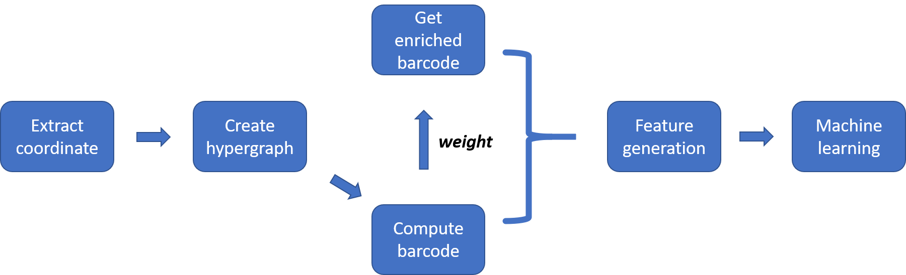
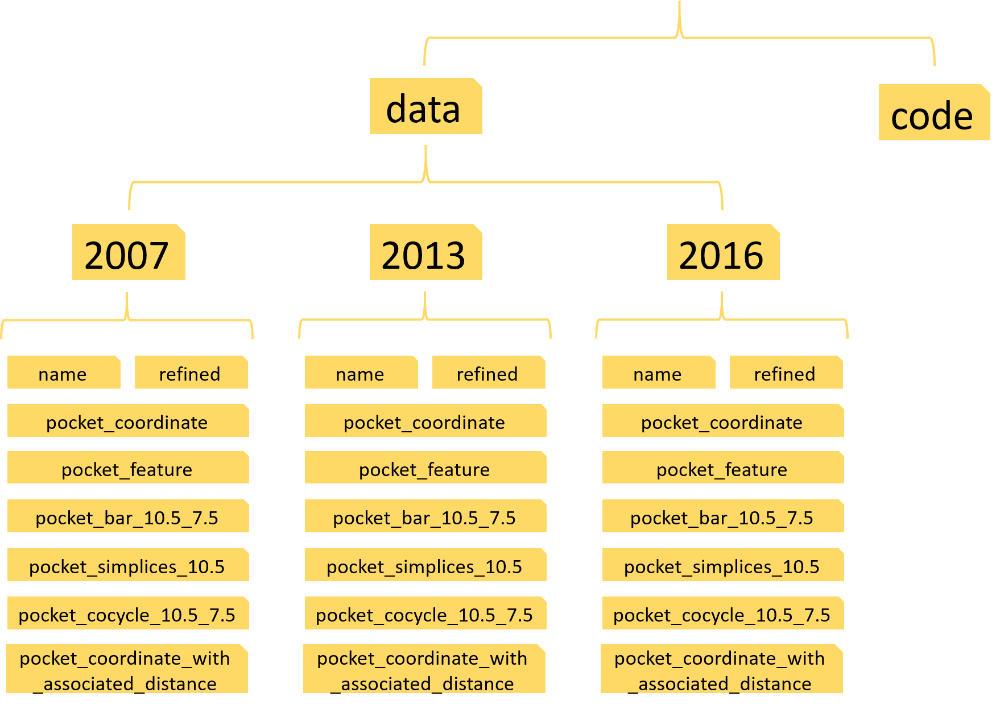

Hypergraph based Persistent cohomology(HPC) for molecular representations in drug design
====
    This manual is for the code implementation of paper 'Hypergraph based Persistent Cohomology(HPC) for molecular
    representations in drug design'
    
****
# Contents
* [1. Software configuration](#Software-configuration)
* [2. Flow of HPC-ML model](#Flow-of-HPC-ML-model)
* [3. Details about each step](#Details-about-each-step)
    * [3.1 Data preparation](#Data-preparation)
    * [3.2 Extract coordinate](#Extract-coordinate)
    * [3.3 Create hypergraph](#Create-hypergraph)
    * [3.4 Compute persistent cohomology](#Compute-persistent-cohomology)
    * [3.5 Get enriched barcode and feature generation](#Get-enriched-barcode-and-feature-generation)
    * [3.6 Machine learning](#Machine-learning)
* [4. Get the results](#Get-the-results)

# Software configuration
---
        Platform: Python>=3.6
        Packages needed: math, numpy>=1.18.1, scipy>=1.4.1, scikit-learn>=0.22.1
# Flow of HPC-ML model
---

# Details about each step
---
## Data preparation
In order to make the protein-ligand binding affinity prediction, you need to download the PDBbind data from this
link http://www.pdbbind.org.cn/. To ensure you can use our code easily, you need to build some folders with the
following structure:  

 

Here, three python scripts: code_for_PDBbind2007.py, code_for_PDBbind2013.py and code_for_PDBbind2016.py 
need to be put into the folder ’code’. There are three sub-folders in folder ’data’, which are named as 2007, 2013
and 2016. For each folder(2007 or 2013 or 2016), there are eight sub-folders and a INDEX_refined.data file. This
INDEX_refined.data file helps to build the targets for the supervised learning. The parameter 10.5 and 7.5 refer to the
cutoff and filtration value we used. More details about eight folders are as follows:  
* name: we have put three index files in this folder, which gives specific training and testing data information.
* refined: you need to put all the refined entries into this file, 1300 entries for PDBbind-2007, 2959 entries for
PDBbind-2013, 4057 entries for PDBbind-2016. Each entry corresponds a folder named the entry’s name and
this folder contains the protein and ligand files.
* pocket_coordinate: this folder place the coordinate data
* pocket_feature: this folder place the feature vectors we construct
* pocket_bar_10.5_7.5: this folder places the barcode
* pocket_simplices_10.5: this folder places the associated simplicial complex of the hypergraph
* pocket_cocycle_10.5_7.5: this folder places the cohomology generators
* pocket_coordinate_with_associated_distance: this folder places the coordinate data and some adjacent distance
information, which contributes to the enriched barcode generation
## Remark
* We have constructed these folders with required files. You can clone our project. Then the only thing you need to
do is putting all the entries into the folder ’refined’ for three databases.
* `Further, we have added all the data needed for PDBbind-2007, you can clone our code and run the script
code_for_PDBbind2007.py to repeat our results for PDBbind2007. You can take it as an example`
## Extract coordinate
With the PDBbind data, we firstly need to extract the atom coordinates. Here, for each protein-ligand complex,
totally 36 atom-combinations are formed with C, N O and S from protein and C, N, O, P, S, F, Cl, Br and I from ligand,
which results in 36 hypergraphs for each protein-ligand complex. In our code, 36 pair files are created, each pair is a
coordinate file and a counting file that records the number of corresponding protein and ligand atoms. Major functions
are as follows:  
```python
def pocket_coordinate_data_to_file(start,end):
    ####################################################################################
    '''
    this function extract the atom coordinates for each atom-pair of protein-ligand
    complex.
    output is a coordinate file and a description file, the description file records
    the number of atoms for protein and ligand. the coordinate file has four columns, 
    the former three columns are the coordinate, the last column are 1 and 2 for protein
    and ligand atoms respectively. 
    (1) start and end are index of data you will deal with
    (2) before this function, you need to prepare the PDBbind data
    '''
    ####################################################################################
```
## Create hypergraph
After getting the coordinate data, now we can construct the hypergraph. In our paper, we have proven that it suffices
to build the filtered associated simplicial complex of the filtered hypergraph because their persistent cohomology are
same. So here we construct the associated simplicial complex of the hypergraph. Major functions are as follows:  
```python
def create_simplices_with_filtration(atom,cutoff,name,P_atom,L_atom,kill_time):
    ###########################################################################################
    ''' 
    this function creates the filtered associated simplicial complex for the hypergraph.
    the dimension only up to 2. you can add higher dimensional information by adding some code. 
    (1) atom is the atom coordinates. the format is same with output of function 
        pocket_coordinate_to_file()
    (2) cutoff determines the binding core region we extract, that is, we extract the ligand
        atoms and the protein atoms within cutoff distance of the ligand. Here, cutoff also 
        determines the largest length of the edges we use to build the hypergraph, here also 
        the associated simplicial complex.(of course you can use many others methods to build 
        the complex, like you can add another parameter max_edge to control the largest length
        of an edge, this is just a way)
    (3) name is the data name.(for example, for PDBbind-2007, it has 1300 data, each data has 
        a name)
    (4) P_atom and L_atom are the atom-combination, like C-C, C-N, etc.
    (5) kill_time is an additional parameter, larger value will lead to longer persistence for
        all the barcode. here we use 0.
    (6) output is a sequence of ordered simplices, i.e. a filtered simplicial complex.
        the format for each simplex is as follows:
        [ index, filtration_value, dimension, vertices of the simplex ]
    '''
    ###########################################################################################
```
## Compute persistent cohomology
With the associated simplicial complex of the hypergraph, we can compute its persistent cohomology barcode. The
coefficient we use is Z/2. Major functions are as follows:  
```python
def get_result(point_cloud,simplices_with_filtration):
    ###########################################################################################
    '''
    this function generates the persistent cohomology barcodes and generators for the 
    associated simplicial complex of a hypergraph.
    (1) point_cloud is the coordinate data of a specific atom-combination of some data,
        the format is same with the output of pocket_coordinate_data_to_file()
    (2) simplicies_with_filtration is the output of function "create_simplices_with_filtration"
    (3) output is the zero_barcodes, zero_generators, one_barcodes and one_generators.
        you can get higher dimensional information by adding some code.
    '''
    ###########################################################################################
```
## Get enriched barcode and feature generation
By adding some weight to the barcode, we can get the enriched barcode. Here, we combine the enriched barcode
generation and feature generation process. Totally, we mainly have three parts, major functions are as follows:  
(1). HPC feature generation  
```python
def get_feature_of_train(start,end,cutoff,filtration,unit):
    ##########################################################################
    '''
    this function generate the training feature vectors from HPC, the method 
    is bin counts.
    (1) cutoff and filtration are same with function "bar_and_cocycle_to_file"
    (2) unit is the size of each bin
    (3) before this function, function bar_and_cocycle_to_file() should be 
        performed to prepare the barcode
    '''
    ##########################################################################

def get_feature_of_test(start,end,cutoff,filtration,unit):
    ##########################################################################
    '''
    this function generate the testing feature vectors from HPC, the method 
    is bin counts.
    (1) cutoff and filtration are same with function "bar_and_cocycle_to_file"
    (2) unit is the size of each bin
    (3) before this function, function bar_and_cocycle_to_file() should be
        performed to prepare the barcode
    '''
    ##########################################################################
```
(2). HWPC feature generation
```python
def get_cocycle_feature_of_train(start,end,cutoff,filtration,unit,eta):
    #######################################################################################
    '''
    this function generate the training feature vectors from HWPC, the method is bin counts.
    (1) start and end are the indexes of the data we deal with
    (2) cutoff and filtration are same with function "bar_and_cocycle_to_file"
    (3) unit is the size of each bin
    (4) eta is the parameter for weight
    (5) before this funcition, function create_coordinate_with_associated_distance() should 
        be performed.
    '''
    #######################################################################################
    
def get_cocycle_feature_of_test(start,end,cutoff,filtration,unit,eta):
    ######################################################################################
    '''
    this function generate the testing feature vectors from HWPC, the method is bin counts.
    (1) start and end are the indexes of the data we deal with
    (2) cutoff and filtration are same with function "bar_and_cocycle_to_file"
    (3) unit is the size of each bin
    (4) eta is the parameter for weight
    (5) before this funcition, function create_coordinate_with_associated_distance() should 
        be performed.
    '''
    ######################################################################################
```
(3). combined feature generation
```python
def get_combined_feature(typ,cutoff,filtration,unit):
    #####################################################################
    '''
    this function get the combined feature vectors from HWPC with 
    a lower eta 2.5 and another HWPC with a higher eta 10
    '''
    #####################################################################
```
## Machine learning
After getting the training and testing features, it is a routine procedure to use machine learning algorithm to make
the prediction. we use gradient boosting tree to make the regression, the parameter setting are as follows:  
|No. of Estimators | Learning rate | Max depth | Subsample | Min_samples_split | Loss function | Max features | Repetitions |
| --- | --- | --- | --- | --- | --- | --- | --- |
|40000 | 0.001 | 9 | 0.7 | 2 | Least square | SQRT | 10 |
# Get the results
---
If you have successfully build the folders, insert the PDBbind data and import the packages we mentioned. Then
you can repeat our results by running these three python scripts: code_for_PDBbind2007.py, code_for_PDBbind2013.py
and code_for_PDBbind2016.py.

        `We have added all the needed data into the folder for PDBbind2007, so just clone our project, then you can repeat
        our results for PDBbind2007 by running python script code_for_PDBbind2007.py. More specifically, you can run the
        following command one by one:`
```linux
git clone https://github.com/LiuXiangMath/Hypergraph-based-Persistent-Cohomology.git
```
```linux
cd Hypergraph-based-Persistent-Cohomology
```
```linux
pip install -r requirements.txt
```
```linux
cd code
```
```linux
python code_for_PDBbind2007.py
```

***

